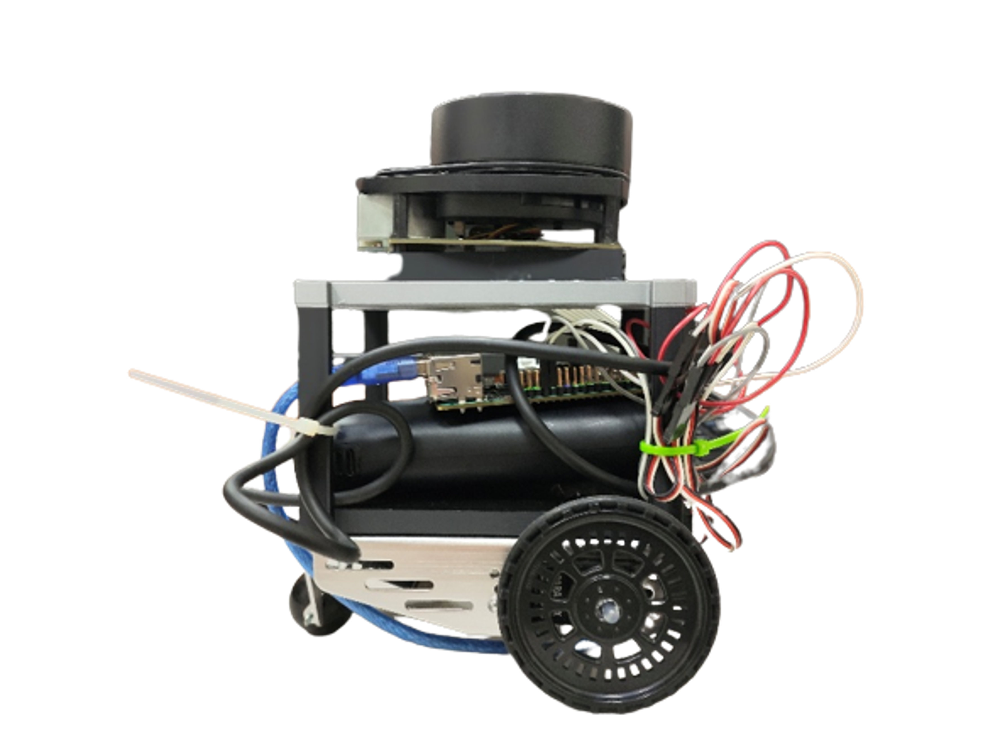
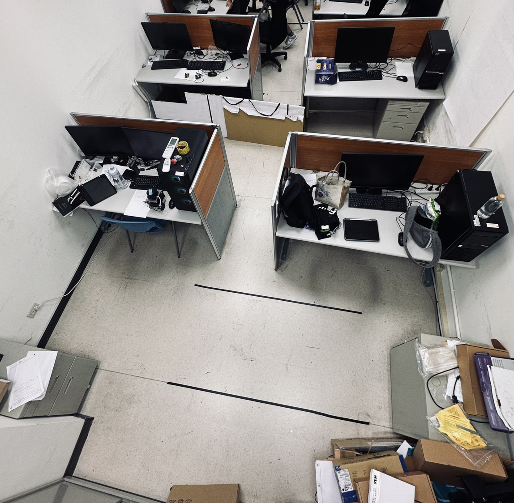

# 光學雷達自走車自主探索建圖系統

**基於機器人作業系統與 Hector SLAM 之光學雷達自走車自主探索建圖系統**
國立勤益科技大學 電機工程系 實務專題（計算機應用組）

以 ASUS Tinker Board、RPLIDAR A1 與 ROS Noetic 打造的差速自走車。車子在未知的室內環境中，以 Hector SLAM 即時定位並建立 2D 地圖，再以 frontier 探索自行決定下一個目標，全程不需人工遙控。

## 成果展示

| 自走車 | 建圖測試場地 |
| --- | --- |
|  |  |

▶ [實測影片：RViz 即時地圖與實車畫面](./專題/media/robot-modeling.mp4)

## 系統架構

```text
RPLIDAR A1 ── /scan ──> hector_mapping ──> /map、/slam_out_pose
   (5.5 Hz)                                       │
                                                  ▼
                                          smart_explorer.py
                                     frontier 探索・避障・航向控制
                                                  │ /cmd_vel
                                                  ▼
                                        motor_driver_fixed.py
                                     速度 → 伺服馬達脈衝（GPIO）

筆電 RViz ── ROS 網路 ──> 遠端監看地圖與車子位置
ai_observer.py（選用）──> 以 CNN 即時判斷所在場景
```

| 項目 | 內容 |
| --- | --- |
| 主控 | ASUS Tinker Board（Armbian） |
| 感測 | RPLIDAR A1：360° 掃描、測距 0.15–12 m、掃描頻率約 5.5 Hz |
| 底盤 | 差速輪底盤、左右連續旋轉伺服馬達 |
| 軟體 | ROS Noetic（Docker 容器執行）、Hector SLAM、Python、OpenCV |

## 主要設計

### 建圖：Hector SLAM（`launch/hector_stable.launch`）

車體沒有輪速計或編碼器，因此選用只靠雷射掃描匹配就能定位的 Hector SLAM。地圖解析度 5 cm、三層多解析度地圖，車子移動 0.2 m 或轉動 0.2 rad 才更新地圖，雷射只取 0.15–5.5 m 的有效距離。

### 自主探索與避障（`scripts/smart_explorer.py`）

- **找邊界**：在地圖上找出已知空地與未知區域的交界（frontier），每 4 秒更新一次目標。
- **選目標**：只考慮 0.5–3 m 內的邊界點，以「距離＋2 倍轉向角」評分，優先往前方走、減少轉彎。
- **避障**：把雷射資料分成前方與左右扇區；前方小於 0.25 m 時，轉向較空曠的一側。
- **脫困**：每 8 秒檢查位移，小於 5 cm 判定卡住，先後退再轉向，並把該目標列入黑名單。

### 航向控制

馬達端沒有回授，航向修正以 Hector SLAM 輸出的位姿作為回授：計算車頭與目標方向的角度誤差 e，轉向命令 ω = 0.15·e，並限制在 ±0.04；誤差超過 0.3 rad（約 17°）時改為半速、邊走邊轉，減少原地旋轉。

### 馬達驅動（`scripts/motor_driver_fixed.py`）

訂閱 `/cmd_vel`，把線速度 v 與角速度 ω 換算成左右輪伺服馬達的脈衝寬度（中立點 ± 1800·v ∓ 500·ω），並限制在安全範圍內。左右輪的中立點分別校正，脈衝命令經一階平滑（係數 0.15）避免急加減速；超過 1 秒沒有收到命令就回到中立點停車。

## LiDAR 場景辨識（CNN）

- `scripts/data_collector.py`：把每一幀雷射掃描畫成 128×128 影像，收集走廊、轉角、右轉角、房間四類各 100 張（`dataset/`）。
- `scripts/ai_observer.py`：在車上以 OpenCV DNN 載入 ONNX 模型即時判斷場景；推論頻率低，且系統負載過高時會自動跳過，優先讓資源給 SLAM。
- `models/`：重新以「時間順序」切分資料訓練的模型與訓練筆記本，測試準確率 80.0%（96／120）。詳見 [models/README.md](./ros_ws/src/my_robot/models/README.md)。

## 執行方式

在 Tinker Board 的 Docker 容器中依序開四個終端機：

```bash
# 1. 雷達（RPLIDAR 官方 ROS 驅動：ros-noetic-rplidar-ros）
roslaunch rplidar_ros rplidar_a1.launch
# 2. 建圖（等雷達啟動後）
roslaunch my_robot hector_stable.launch
# 3. 底盤馬達
rosrun my_robot motor_driver_fixed.py
# 4. 自主探索（地圖出現後再啟動）
rosrun my_robot smart_explorer.py
# （選用）場景辨識
rosrun my_robot ai_observer.py
```

在筆電上以 RViz 遠端監看：

```bash
export ROS_MASTER_URI=http://<Tinker Board IP>:11311
export ROS_IP=<筆電 IP>
source /opt/ros/noetic/setup.bash
rviz
```

### 沒有硬體時：Gazebo 模擬

`ros_ws/src/my_robot_sim/` 以 Gazebo 的雷射與差速驅動取代實體雷達和馬達，可在一般電腦或 GitHub Codespaces 上跑完整的「掃描 → 建圖 → 探索」流程，說明見 [my_robot_sim/README.md](./ros_ws/src/my_robot_sim/README.md)。

## 目錄

```text
├── 專題/                    專題報告、海報、成果簡報、照片與影片
└── ros_ws/src/
    ├── my_robot/            專題 ROS 套件
    │   ├── launch/          Hector SLAM 設定
    │   ├── scripts/         探索、馬達驅動、資料收集與場景辨識節點
    │   ├── maps/            實測建立的地圖
    │   ├── dataset/         LiDAR 場景影像（4 類 × 100 張）
    │   └── models/          CNN 模型、訓練筆記本與結果
    └── my_robot_sim/        Gazebo 模擬
```

## 限制與未來方向

- 在長廊或空曠、特徵較少的場地，掃描匹配容易產生定位誤差，目前以降低車速來維持建圖品質。
- 未來希望量化車速、感測更新率與建圖誤差的關係，並把場景辨識結果接入速度控制，只在轉角等需要的地方減速。
- 場景辨識的資料來自單一場地，下一步是擴充不同地點的資料，提升模型在新環境的可靠度。

## 專題文件

- [專題報告](./專題/專題報告.docx)
- [專題海報](./專題/專題海報.pdf)
- [成果簡報](./專題/成果簡報.pdf)

## 成員

指導老師：賴香月
組員：葉旭桓、艾佳緯、郭昊宸、鍾佑昇
