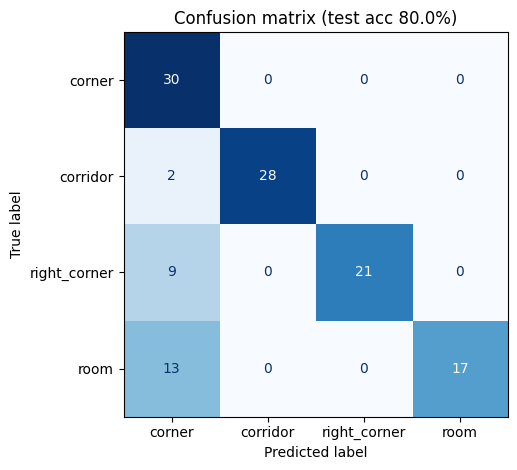
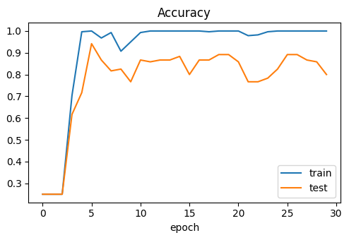

# LiDAR 場景辨識模型

| 檔案 | 說明 |
| --- | --- |
| `train_lidar_cnn_colab.ipynb` | Google Colab 訓練筆記本：讀取 `dataset/`、訓練 CNN、評估並匯出 ONNX |
| `lidar_brain_v2.onnx` | 重新訓練的模型，輸入 1×1×128×128（數值 0–1），類別順序同 `scripts/classes.json` |

`scripts/lidar_brain.onnx` 是專題期間在車上使用的初版模型。

## 訓練方式

- 資料：走廊、轉角、右轉角、房間四類，各 100 張 128×128 雷射掃描影像。
- 切分：依時間順序，每類前 70% 訓練、後 30% 測試（280／120 張），避免相鄰、幾乎相同的影格同時出現在訓練與測試中。
- 模型：4 層卷積 CNN（約 6 萬個參數），加入旋轉與平移的資料增強，訓練 30 輪。

## 結果

測試準確率 **80.0%（96／120）**；以 OpenCV DNN 載入 ONNX 重跑測試，結果相同。

| 混淆矩陣 | 準確率變化（藍：訓練、橘：測試） |
| --- | --- |
|  |  |

| 類別 | 召回率 | 精確率 |
| --- | --- | --- |
| 走廊 corridor | 93% | 100% |
| 轉角 corner | 100% | 56% |
| 右轉角 right_corner | 70% | 100% |
| 房間 room | 57% | 100% |

觀察：

- 訓練準確率達 100%，測試在 77%–94% 間起伏，有過擬合現象。
- 24 張誤判全部被判成「轉角」，模型不確定時偏向單一類別。
- 每類資料是同一地點約 30 秒的連續影格，多樣性不足；下一步是到不同地點收集資料。
